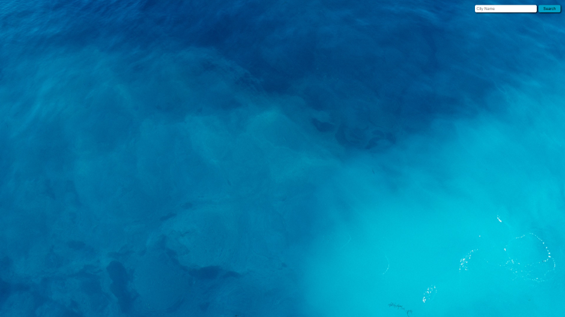
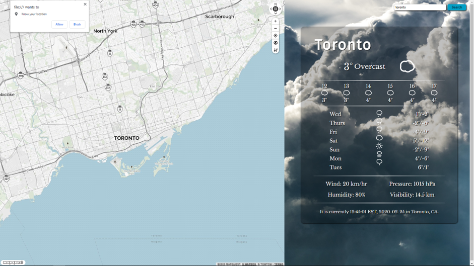
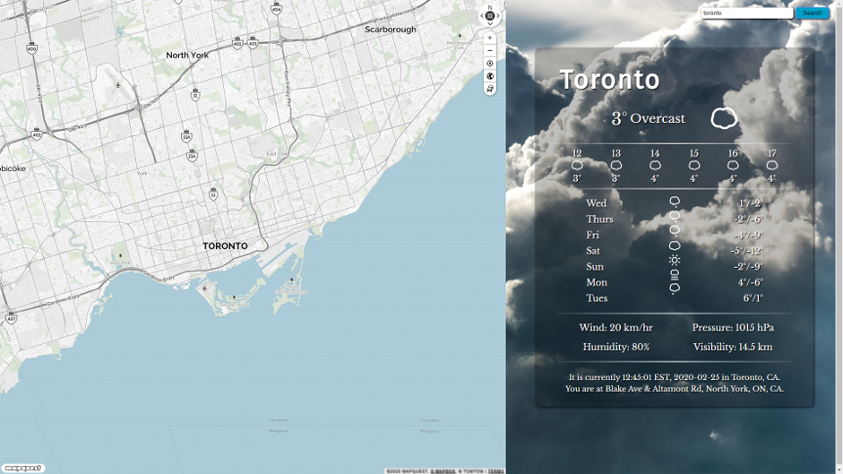
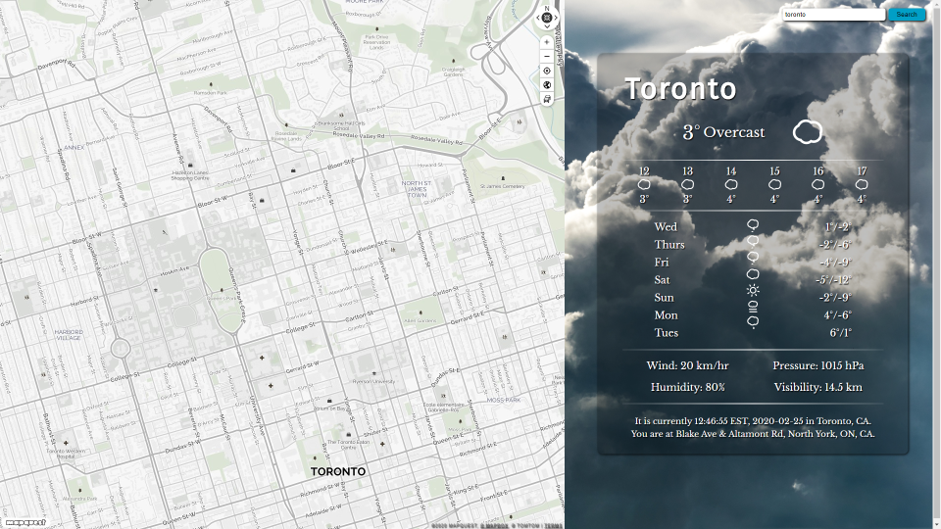
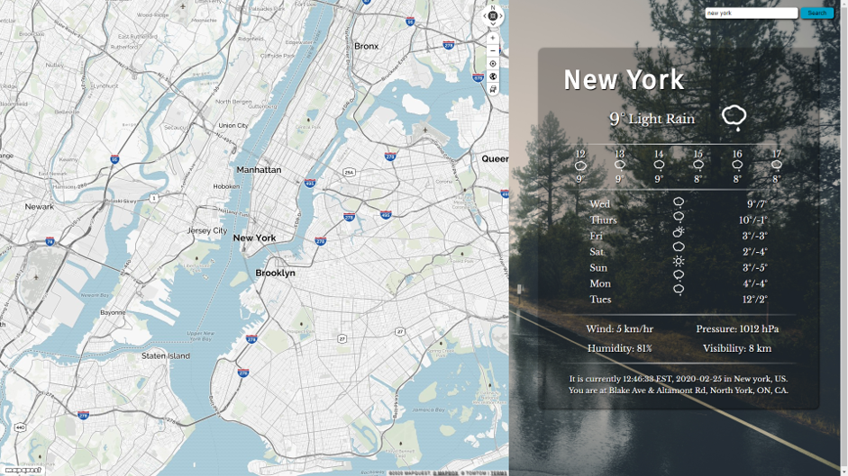

# Weather-Forecast-App

A simple weather app with map, weather and time zone information.

Used OpenWeatherMap, MapQuest, Dark Sky, TimeZoneDB as data resources.

Implemented JS functions, including: automatic location detection using Navigator Geolocation, event listening &
trigger function, page element animation using jQuery selector and Ajax to request external data services.

Perfected page view using Google Fonts and imported Skycons to add animated weather glyphs updating effects. 

How to use:

Enter the city to search for, then click the search button and there will be a new pop-up window asking for permission of location sharing.

Allow location sharing and the page will show weather forecast for the upcoming week using animated weather glyphs.

The map can be dragged around, zoomed in and out.

The background changes according to the current weather of the target city.

